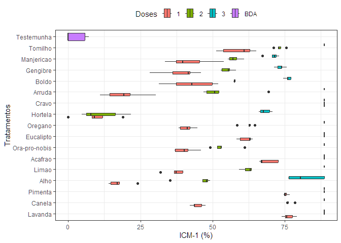
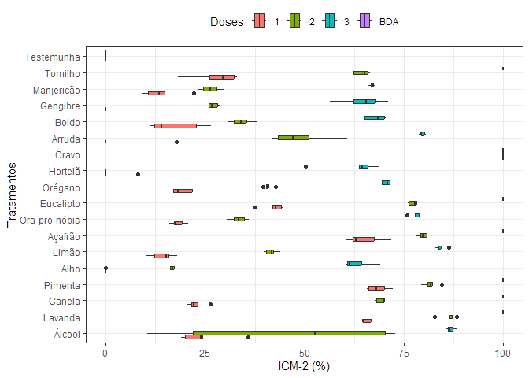
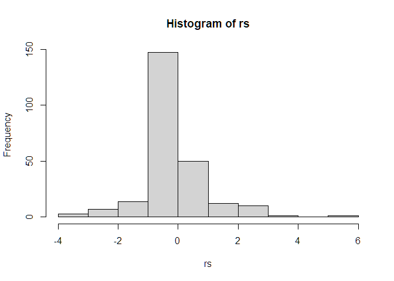
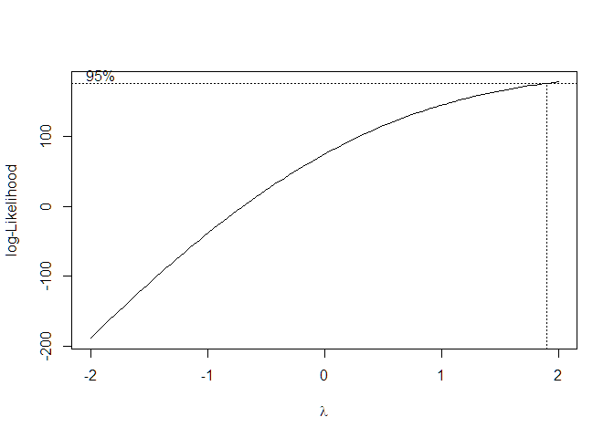
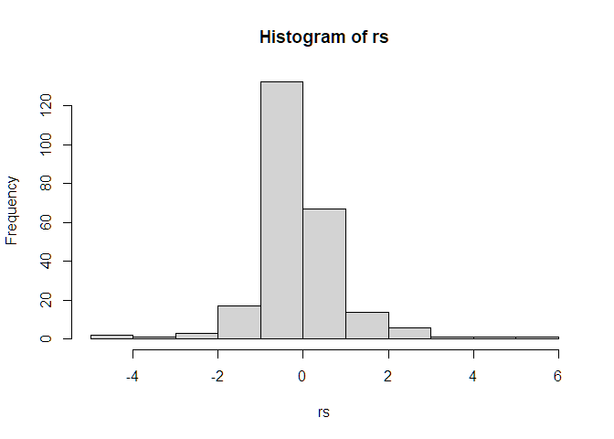
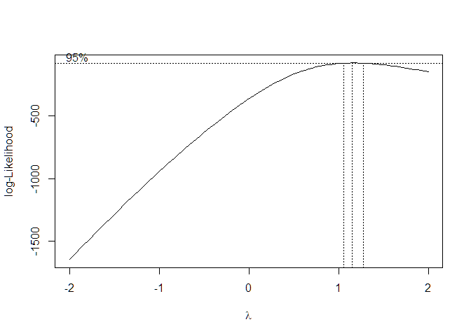

<!-- README.md is generated from README.Rmd. Please edit that file -->

# Mestrado - Marcelo Bernardi

## Carregando Pacotes

``` r
library(tidyverse)
```

## Carregando Dados

``` r
data_set <- readr::read_rds("data/data-icm.rds") |> 
  filter(tratamento != 1)
data_set |>  glimpse()
#> Rows: 245
#> Columns: 6
#> $ tratamento <dbl> 2, 2, 2, 2, 2, 2, 2, 2, 2, 2, 2, 2, 2, 2, 2, 3, 3, 3, 3, 3,…
#> $ dose       <chr> "1", "1", "1", "1", "1", "2", "2", "2", "2", "2", "3", "3",…
#> $ repeticao  <dbl> 1, 2, 3, 4, 5, 1, 2, 3, 4, 5, 1, 2, 3, 4, 5, 1, 2, 3, 4, 5,…
#> $ icm_1      <dbl> 75.22064, 73.97601, 79.18081, 77.59674, 75.67323, 88.68522,…
#> $ icm_2      <dbl> 64.65116, 62.84884, 66.68605, 67.20930, 64.76744, 82.67442,…
#> $ trat       <chr> "Lavanda", "Lavanda", "Lavanda", "Lavanda", "Lavanda", "Lav…
```

## Boxplot

``` r
data_set |> 
  ggplot(aes(y=as_factor(trat),x=icm_1,
             fill=as_factor(dose))) +
  geom_boxplot() +
  theme_bw() +
  theme(
    legend.position = "top"
  ) +
  labs(x = "ICM-1 (%)",
       y = "Tratamentos",
       fill="Doses")
```

<!-- -->

``` r
data_set |> 
  ggplot(aes(y=as_factor(trat),x=icm_2,
             fill=as_factor(dose))) +
  geom_boxplot() +
  theme_bw() +
  theme(
    legend.position = "top"
  ) +
  labs(x = "ICM-2 (%)",
       y = "Tratamentos",
       fill="Doses")
```

<!-- -->

## Tabela de Médias

``` r
data_set |> 
  group_by(tratamento, dose) |> 
  summarise(
    imc1 = mean(icm_1,na.rm=TRUE),
    imc2 = mean(icm_2,na.rm=TRUE),
  ) |> 
  writexl::write_xlsx("output/tabela-medias.xlsx")
```

## Análise de variância - DIA 1

``` r
trat <- interaction(data_set$tratamento,data_set$dose)
icm_1 <- data_set$icm_1 + 1
yt <- (icm_1/100+1)^1.95959596
mod1 <- aov(yt ~ trat)
anova(mod1)
#> Analysis of Variance Table
#> 
#> Response: yt
#>            Df  Sum Sq Mean Sq F value    Pr(>F)    
#> trat       48 133.233 2.77569     260 < 2.2e-16 ***
#> Residuals 196   2.092 0.01068                      
#> ---
#> Signif. codes:  0 '***' 0.001 '**' 0.01 '*' 0.05 '.' 0.1 ' ' 1
rs <- rstudent(mod1)
yp <- predict(mod1)
hist(rs)
```

<!-- -->

``` r
shapiro.test(rs)
#> 
#>  Shapiro-Wilk normality test
#> 
#> data:  rs
#> W = 0.85849, p-value = 3.157e-14
lawstat::levene.test(yt,trat)
#> 
#>  Modified robust Brown-Forsythe Levene-type test based on the absolute
#>  deviations from the median
#> 
#> data:  yt
#> Test Statistic = 2.5765, p-value = 2.557e-06
bxc <- MASS::boxcox(mod1)
```

<!-- -->

``` r
# data.frame(bxc$y,bxc$x) |> arrange(desc(bxc.y))
```

``` r
filtro <- data_set$tratamento != 18
trat <- data_set$tratamento[filtro]
dose <- data_set$dose[filtro]
rep <- data_set$repeticao[filtro]
y <- data_set$icm_1[filtro]
yad <- data_set$icm_1[!filtro]

ExpDes.pt::fat2.ad.dic(trat, dose, rep, y, yad,
                       mcomp = "tukey",
                       quali = c(TRUE, TRUE),
                       fac.names = c("Extrato","Dose"))
#> ------------------------------------------------------------------------
#> Legenda:
#> FATOR 1:  Extrato 
#> FATOR 2:  Dose 
#> ------------------------------------------------------------------------
#> 
#> ------------------------------------------------------------------------
#> Quadro da analise de variancia
#> ------------------------------------------------------------------------
#>                 GL         SQ          QM        Fc Pr>Fc
#> Extrato         15  56600.007  3773.33378  274.6163     0
#> Dose             2  53175.641 26587.82075 1935.0127     0
#> Extrato*Dose    30  19160.679   638.68928   46.4826     0
#> Ad vs Fatorial   1  19609.948 19609.94793 1427.1759     0
#> Residuo        196   2693.116    13.74039                
#> Total          244 151239.390                            
#> ------------------------------------------------------------------------
#> CV = 5.74 %
#> 
#> ------------------------------------------------------------------------
#> Teste de normalidade dos residuos (Shapiro-Wilk)
#> valor-p:  4.335327e-14 
#> ATENCAO: a 5% de significancia, os residuos nao podem ser considerados normais!
#> ------------------------------------------------------------------------
#> Contraste do tratamento adicional com o fatorial
#> ------------------------------------------------------------------------
#>              Medias  
#> Adicional  2.570717 a
#> Fatorial  65.845497 b
#> ------------------------------------------------------------------------
#> 
#> 
#> 
#> Interacao significativa: desdobrando a interacao
#> ------------------------------------------------------------------------
#> 
#> Desdobrando  Extrato  dentro de cada nivel de  Dose 
#> ------------------------------------------------------------------------
#> ------------------------------------------------------------------------
#> Quadro da analise de variancia
#> ------------------------------------------------------------------------
#>                 GL         SQ          QM        Fc Pr>Fc
#> Dose             2  53175.641 26587.82075 1935.0127     0
#> Extrato:Dose 1  15  37838.219  2522.54794  183.5864     0
#> Extrato:Dose 2  15  33711.728  2247.44852  163.5652     0
#> Extrato:Dose 3  15   4210.738   280.71588     20.43     0
#> Ad vs Fatorial   1  19609.948 19609.94793 1427.1759     0
#> Residuo        196   2693.116    13.74039                
#> Total          244 151239.390                            
#> ------------------------------------------------------------------------
#> 
#> 
#> 
#>  Extrato  dentro do nivel  1  de  Dose 
#> ------------------------------------------------------------------------
#> Teste de Tukey
#> ------------------------------------------------------------------------
#> Grupos Tratamentos Medias
#> a     12      88.68522 
#>  b    2   76.32949 
#>  b    4   75.35642 
#>  bc   7   69.15592 
#>   cd      9   61.55239 
#>    d      17      58.79158 
#>     e     3   44.69337 
#>     e     14      42.65671 
#>     e     16      41.95519 
#>     e     10      41.05001 
#>     e     8   40.30324 
#>     e     15      38.80969 
#>     e     6   37.11247 
#>      f    13      19.30301 
#>      fg   5   17.49265 
#>       g   11      9.599457 
#> ------------------------------------------------------------------------
#> 
#> 
#>  Extrato  dentro do nivel  2  de  Dose 
#> ------------------------------------------------------------------------
#> Teste de Tukey
#> ------------------------------------------------------------------------
#> Grupos Tratamentos Medias
#> a     12      88.68522 
#> a     2   88.68522 
#> a     4   88.68522 
#> a     7   88.68522 
#> a     9   88.68522 
#>  b    3   76.57841 
#>  b    17      73.09346 
#>   c   10      62.32179 
#>   c   6   62.0955 
#>   cd      14      57.56959 
#>   cd      16      57.5017 
#>   cd      15      55.08033 
#>    d      8   53.60941 
#>    de     13      53.40575 
#>     e     5   45.46277 
#>      f    11      11.38267 
#> ------------------------------------------------------------------------
#> 
#> 
#>  Extrato  dentro do nivel  3  de  Dose 
#> ------------------------------------------------------------------------
#> Teste de Tukey
#> ------------------------------------------------------------------------
#> Grupos Tratamentos Medias
#> a     10      88.68522 
#> a     12      88.68522 
#> a     13      88.68522 
#> a     17      88.68522 
#> a     2   88.68522 
#> a     3   88.68522 
#> a     4   88.68522 
#> a     6   88.68522 
#> a     7   88.68522 
#> a     8   88.68522 
#> a     9   88.68522 
#> ab    5   82.07739 
#>  bc   14      76.12582 
#>   c   15      73.47816 
#>   c   16      70.87576 
#>   c   11      68.11496 
#> ------------------------------------------------------------------------
#> 
#> 
#> 
#> Desdobrando  Dose  dentro de cada nivel de  Extrato 
#> ------------------------------------------------------------------------
#> ------------------------------------------------------------------------
#> Quadro da analise de variancia
#> ------------------------------------------------------------------------
#>                  GL          SQ          QM        Fc Pr>Fc
#> Extrato          15  56600.0066  3773.33378  274.6163     0
#> Dose:Extrato 2    2    508.8808   254.44038   18.5177     0
#> Dose:Extrato 3    2   5164.1899  2582.09495  187.9201     0
#> Dose:Extrato 4    2    592.1904   296.09518   21.5493     0
#> Dose:Extrato 5    2  10490.2468  5245.12338  381.7304     0
#> Dose:Extrato 6    2   6651.5236  3325.76181  242.0428     0
#> Dose:Extrato 7    2   1271.3126   635.65627   46.2619     0
#> Dose:Extrato 8    2   6246.9723  3123.48617  227.3216     0
#> Dose:Extrato 9    2   2453.9692   1226.9846   89.2977     0
#> Dose:Extrato 10   2   5694.3875  2847.19377  207.2135     0
#> Dose:Extrato 11   2  11076.3279  5538.16393  403.0574     0
#> Dose:Extrato 12   2      0.0000           0         0     1
#> Dose:Extrato 13   2  12035.8827  6017.94134  437.9747     0
#> Dose:Extrato 14   2   2811.5151  1405.75757  102.3084     0
#> Dose:Extrato 15   2   3008.5290  1504.26449  109.4776     0
#> Dose:Extrato 16   2   2094.9314  1047.46568   76.2326     0
#> Dose:Extrato 17   2   2235.4610  1117.73047   81.3464     0
#> Ad vs Fatorial    1  19609.9479 19609.94793 1427.1759     0
#> Residuo         196   2693.1156    13.74039                
#> Total           244 151239.3902                            
#> ------------------------------------------------------------------------
#> 
#> 
#> 
#>  Dose  dentro do nivel  2  de  Extrato 
#> ------------------------------------------------------------------------
#> Teste de Tukey
#> ------------------------------------------------------------------------
#> Grupos Tratamentos Medias
#> a     2   88.68522 
#> a     3   88.68522 
#>  b    1   76.32949 
#> ------------------------------------------------------------------------
#> 
#> 
#>  Dose  dentro do nivel  3  de  Extrato 
#> ------------------------------------------------------------------------
#> Teste de Tukey
#> ------------------------------------------------------------------------
#> Grupos Tratamentos Medias
#> a     3   88.68522 
#>  b    2   76.57841 
#>   c   1   44.69337 
#> ------------------------------------------------------------------------
#> 
#> 
#>  Dose  dentro do nivel  4  de  Extrato 
#> ------------------------------------------------------------------------
#> Teste de Tukey
#> ------------------------------------------------------------------------
#> Grupos Tratamentos Medias
#> a     2   88.68522 
#> a     3   88.68522 
#>  b    1   75.35642 
#> ------------------------------------------------------------------------
#> 
#> 
#>  Dose  dentro do nivel  5  de  Extrato 
#> ------------------------------------------------------------------------
#> Teste de Tukey
#> ------------------------------------------------------------------------
#> Grupos Tratamentos Medias
#> a     3   82.07739 
#>  b    2   45.46277 
#>   c   1   17.49265 
#> ------------------------------------------------------------------------
#> 
#> 
#>  Dose  dentro do nivel  6  de  Extrato 
#> ------------------------------------------------------------------------
#> Teste de Tukey
#> ------------------------------------------------------------------------
#> Grupos Tratamentos Medias
#> a     3   88.68522 
#>  b    2   62.0955 
#>   c   1   37.11247 
#> ------------------------------------------------------------------------
#> 
#> 
#>  Dose  dentro do nivel  7  de  Extrato 
#> ------------------------------------------------------------------------
#> Teste de Tukey
#> ------------------------------------------------------------------------
#> Grupos Tratamentos Medias
#> a     2   88.68522 
#> a     3   88.68522 
#>  b    1   69.15592 
#> ------------------------------------------------------------------------
#> 
#> 
#>  Dose  dentro do nivel  8  de  Extrato 
#> ------------------------------------------------------------------------
#> Teste de Tukey
#> ------------------------------------------------------------------------
#> Grupos Tratamentos Medias
#> a     3   88.68522 
#>  b    2   53.60941 
#>   c   1   40.30324 
#> ------------------------------------------------------------------------
#> 
#> 
#>  Dose  dentro do nivel  9  de  Extrato 
#> ------------------------------------------------------------------------
#> Teste de Tukey
#> ------------------------------------------------------------------------
#> Grupos Tratamentos Medias
#> a     2   88.68522 
#> a     3   88.68522 
#>  b    1   61.55239 
#> ------------------------------------------------------------------------
#> 
#> 
#>  Dose  dentro do nivel  10  de  Extrato 
#> ------------------------------------------------------------------------
#> Teste de Tukey
#> ------------------------------------------------------------------------
#> Grupos Tratamentos Medias
#> a     3   88.68522 
#>  b    2   62.32179 
#>   c   1   41.05001 
#> ------------------------------------------------------------------------
#> 
#> 
#>  Dose  dentro do nivel  11  de  Extrato 
#> ------------------------------------------------------------------------
#> Teste de Tukey
#> ------------------------------------------------------------------------
#> Grupos Tratamentos Medias
#> a     3   68.11496 
#>  b    2   11.38267 
#>  b    1   9.599457 
#> ------------------------------------------------------------------------
#> 
#> 
#>  Dose  dentro do nivel  12  de  Extrato 
#> 
#> De acordo com o teste F, as medias desse fator sao estatisticamente iguais.
#> ------------------------------------------------------------------------
#>   Niveis   Medias
#> 1      1 88.68522
#> 2      2 88.68522
#> 3      3 88.68522
#> ------------------------------------------------------------------------
#> 
#> 
#>  Dose  dentro do nivel  13  de  Extrato 
#> ------------------------------------------------------------------------
#> Teste de Tukey
#> ------------------------------------------------------------------------
#> Grupos Tratamentos Medias
#> a     3   88.68522 
#>  b    2   53.40575 
#>   c   1   19.30301 
#> ------------------------------------------------------------------------
#> 
#> 
#>  Dose  dentro do nivel  14  de  Extrato 
#> ------------------------------------------------------------------------
#> Teste de Tukey
#> ------------------------------------------------------------------------
#> Grupos Tratamentos Medias
#> a     3   76.12582 
#>  b    2   57.56959 
#>   c   1   42.65671 
#> ------------------------------------------------------------------------
#> 
#> 
#>  Dose  dentro do nivel  15  de  Extrato 
#> ------------------------------------------------------------------------
#> Teste de Tukey
#> ------------------------------------------------------------------------
#> Grupos Tratamentos Medias
#> a     3   73.47816 
#>  b    2   55.08033 
#>   c   1   38.80969 
#> ------------------------------------------------------------------------
#> 
#> 
#>  Dose  dentro do nivel  16  de  Extrato 
#> ------------------------------------------------------------------------
#> Teste de Tukey
#> ------------------------------------------------------------------------
#> Grupos Tratamentos Medias
#> a     3   70.87576 
#>  b    2   57.5017 
#>   c   1   41.95519 
#> ------------------------------------------------------------------------
#> 
#> 
#>  Dose  dentro do nivel  17  de  Extrato 
#> ------------------------------------------------------------------------
#> Teste de Tukey
#> ------------------------------------------------------------------------
#> Grupos Tratamentos Medias
#> a     3   88.68522 
#>  b    2   73.09346 
#>   c   1   58.79158 
#> ------------------------------------------------------------------------
```

## Análise de variância - DIA 2

``` r
trat <- interaction(data_set$tratamento,data_set$dose)
icm_2 <- data_set$icm_2 + 1
yt <- (icm_2/100+1)^1.95959596
mod2 <- aov(icm_2 ~ trat)
anova(mod2)
#> Analysis of Variance Table
#> 
#> Response: icm_2
#>            Df Sum Sq Mean Sq F value    Pr(>F)    
#> trat       48 257286  5360.1  501.16 < 2.2e-16 ***
#> Residuals 196   2096    10.7                      
#> ---
#> Signif. codes:  0 '***' 0.001 '**' 0.01 '*' 0.05 '.' 0.1 ' ' 1
rs <- rstudent(mod2)
yp <- predict(mod2)
hist(rs)
```

<!-- -->

``` r
shapiro.test(rs)
#> 
#>  Shapiro-Wilk normality test
#> 
#> data:  rs
#> W = 0.85832, p-value = 3.091e-14
lawstat::levene.test(yt,trat)
#> 
#>  Modified robust Brown-Forsythe Levene-type test based on the absolute
#>  deviations from the median
#> 
#> data:  yt
#> Test Statistic = 1.7676, p-value = 0.003684
bxc <- MASS::boxcox(mod2)
```

<!-- -->

``` r
# data.frame(bxc$y,bxc$x) |> arrange(desc(bxc.y))
```

``` r
filtro <- data_set$tratamento != 18
trat <- data_set$tratamento[filtro]
dose <- data_set$dose[filtro]
rep <- data_set$repeticao[filtro]
y <- data_set$icm_2[filtro]
yad <- data_set$icm_2[!filtro]

ExpDes.pt::fat2.ad.dic(trat, dose, rep, y, yad,
                       mcomp = "tukey",
                       quali = c(TRUE, TRUE),
                       fac.names = c("Extrato","Dose"))
#> ------------------------------------------------------------------------
#> Legenda:
#> FATOR 1:  Extrato 
#> FATOR 2:  Dose 
#> ------------------------------------------------------------------------
#> 
#> ------------------------------------------------------------------------
#> Quadro da analise de variancia
#> ------------------------------------------------------------------------
#>                 GL         SQ          QM        Fc Pr>Fc
#> Extrato         15 113517.732  7567.84883  707.5731     0
#> Dose             2 107006.925 53503.46272 5002.4268     0
#> Extrato*Dose    30  22503.800   750.12667   70.1348     0
#> Ad vs Fatorial   1  14257.088 14257.08768 1332.9985     0
#> Residuo        196   2096.318     10.6955                
#> Total          244 259381.864                            
#> ------------------------------------------------------------------------
#> CV = 6.19 %
#> 
#> ------------------------------------------------------------------------
#> Teste de normalidade dos residuos (Shapiro-Wilk)
#> valor-p:  1.39503e-13 
#> ATENCAO: a 5% de significancia, os residuos nao podem ser considerados normais!
#> ------------------------------------------------------------------------
#> Contraste do tratamento adicional com o fatorial
#> ------------------------------------------------------------------------
#>             Medias  
#> Adicional  0.00000 a
#> Fatorial  53.95203 b
#> ------------------------------------------------------------------------
#> 
#> 
#> 
#> Interacao significativa: desdobrando a interacao
#> ------------------------------------------------------------------------
#> 
#> Desdobrando  Extrato  dentro de cada nivel de  Dose 
#> ------------------------------------------------------------------------
#> ------------------------------------------------------------------------
#> Quadro da analise de variancia
#> ------------------------------------------------------------------------
#>                 GL         SQ          QM        Fc Pr>Fc
#> Dose             2 107006.925 53503.46272 5002.4268     0
#> Extrato:Dose 1  15  62499.311  4166.62076  389.5676     0
#> Extrato:Dose 2  15  60381.860  4025.45735  376.3692     0
#> Extrato:Dose 3  15  13140.361   876.02406   81.9058     0
#> Ad vs Fatorial   1  14257.088 14257.08768 1332.9985     0
#> Residuo        196   2096.318     10.6955                
#> Total          244 259381.864                            
#> ------------------------------------------------------------------------
#> 
#> 
#> 
#>  Extrato  dentro do nivel  1  de  Dose 
#> ------------------------------------------------------------------------
#> Teste de Tukey
#> ------------------------------------------------------------------------
#> Grupos Tratamentos Medias
#> a     12      94.18605 
#>  b    4   68.44186 
#>  b    2   65.23256 
#>  b    7   64.98837 
#>   c   9   42.22093 
#>    d      17      27.7907 
#>    de     3   22.75581 
#>     ef    10      19 
#>     ef    8   18.11628 
#>     ef    14      17.30233 
#>      f    6   14.2093 
#>      f    16      13.98837 
#>       g   13      3.569767 
#>       g   11      1.627907 
#>       g   15      0 
#>       g   5   0 
#> ------------------------------------------------------------------------
#> 
#> 
#>  Extrato  dentro do nivel  2  de  Dose 
#> ------------------------------------------------------------------------
#> Teste de Tukey
#> ------------------------------------------------------------------------
#> Grupos Tratamentos Medias
#> a     12      94.18605 
#>  b    2   86.4186 
#>  bc   4   81.7907 
#>  bc   7   79.77907 
#>   c   9   77.26744 
#>    d      3   69.18605 
#>    d      17      64.5 
#>     e     13      48.81395 
#>      f    6   41.60465 
#>      fg   10      40.86047 
#>       gh      14      34.17442 
#>        hi     8   33.36047 
#>        hi     15      27.13953 
#>         i     16      26.2907 
#>          j    5   13.48837 
#>           k   11      0 
#> ------------------------------------------------------------------------
#> 
#> 
#>  Extrato  dentro do nivel  3  de  Dose 
#> ------------------------------------------------------------------------
#> Teste de Tukey
#> ------------------------------------------------------------------------
#> Grupos Tratamentos Medias
#> a     12      94.18605 
#> a     17      94.18605 
#> a     2   94.18605 
#> a     3   94.18605 
#> a     4   94.18605 
#> a     7   94.18605 
#> a     9   94.18605 
#>  b    6   84.18605 
#>  b    13      79.63953 
#>  bc   8   77.97674 
#>   cd      10      70.84884 
#>    de     14      67.88372 
#>    de     16      67.06977 
#>    de     15      64.63953 
#>     e     5   63.17442 
#>     e     11      62.68605 
#> ------------------------------------------------------------------------
#> 
#> 
#> 
#> Desdobrando  Dose  dentro de cada nivel de  Extrato 
#> ------------------------------------------------------------------------
#> ------------------------------------------------------------------------
#> Quadro da analise de variancia
#> ------------------------------------------------------------------------
#>                  GL         SQ          QM        Fc Pr>Fc
#> Extrato          15 113517.732  7567.84883  707.5731     0
#> Dose:Extrato 2    2   2245.810  1122.90517  104.9885     0
#> Dose:Extrato 3    2  13138.408  6569.20385  614.2025     0
#> Dose:Extrato 4    2   1657.665    828.8327   77.4936     0
#> Dose:Extrato 5    2  11069.411  5534.70547  517.4798     0
#> Dose:Extrato 6    2  12434.042  6217.02091  581.2744     0
#> Dose:Extrato 7    2   2131.383  1065.69159   99.6392     0
#> Dose:Extrato 8    2   9677.121  4838.56071  452.3921     0
#> Dose:Extrato 9    2   7024.784  3512.39206   328.399     0
#> Dose:Extrato 10   2   6775.807   3387.9036  316.7597     0
#> Dose:Extrato 11   2  12767.145  6383.57243  596.8465     0
#> Dose:Extrato 12   2      0.000           0         0     1
#> Dose:Extrato 13   2  14639.771   7319.8853  684.3892     0
#> Dose:Extrato 14   2   6632.437  3316.21845  310.0573     0
#> Dose:Extrato 15   2  10535.123  5267.56152  492.5025     0
#> Dose:Extrato 16   2   7719.857  3859.92856  360.8927     0
#> Dose:Extrato 17   2  11061.961  5530.98048  517.1315     0
#> Ad vs Fatorial    1  14257.088 14257.08768 1332.9985     0
#> Residuo         196   2096.318     10.6955                
#> Total           244 259381.864                            
#> ------------------------------------------------------------------------
#> 
#> 
#> 
#>  Dose  dentro do nivel  2  de  Extrato 
#> ------------------------------------------------------------------------
#> Teste de Tukey
#> ------------------------------------------------------------------------
#> Grupos Tratamentos Medias
#> a     3   94.18605 
#>  b    2   86.4186 
#>   c   1   65.23256 
#> ------------------------------------------------------------------------
#> 
#> 
#>  Dose  dentro do nivel  3  de  Extrato 
#> ------------------------------------------------------------------------
#> Teste de Tukey
#> ------------------------------------------------------------------------
#> Grupos Tratamentos Medias
#> a     3   94.18605 
#>  b    2   69.18605 
#>   c   1   22.75581 
#> ------------------------------------------------------------------------
#> 
#> 
#>  Dose  dentro do nivel  4  de  Extrato 
#> ------------------------------------------------------------------------
#> Teste de Tukey
#> ------------------------------------------------------------------------
#> Grupos Tratamentos Medias
#> a     3   94.18605 
#>  b    2   81.7907 
#>   c   1   68.44186 
#> ------------------------------------------------------------------------
#> 
#> 
#>  Dose  dentro do nivel  5  de  Extrato 
#> ------------------------------------------------------------------------
#> Teste de Tukey
#> ------------------------------------------------------------------------
#> Grupos Tratamentos Medias
#> a     3   63.17442 
#>  b    2   13.48837 
#>   c   1   0 
#> ------------------------------------------------------------------------
#> 
#> 
#>  Dose  dentro do nivel  6  de  Extrato 
#> ------------------------------------------------------------------------
#> Teste de Tukey
#> ------------------------------------------------------------------------
#> Grupos Tratamentos Medias
#> a     3   84.18605 
#>  b    2   41.60465 
#>   c   1   14.2093 
#> ------------------------------------------------------------------------
#> 
#> 
#>  Dose  dentro do nivel  7  de  Extrato 
#> ------------------------------------------------------------------------
#> Teste de Tukey
#> ------------------------------------------------------------------------
#> Grupos Tratamentos Medias
#> a     3   94.18605 
#>  b    2   79.77907 
#>   c   1   64.98837 
#> ------------------------------------------------------------------------
#> 
#> 
#>  Dose  dentro do nivel  8  de  Extrato 
#> ------------------------------------------------------------------------
#> Teste de Tukey
#> ------------------------------------------------------------------------
#> Grupos Tratamentos Medias
#> a     3   77.97674 
#>  b    2   33.36047 
#>   c   1   18.11628 
#> ------------------------------------------------------------------------
#> 
#> 
#>  Dose  dentro do nivel  9  de  Extrato 
#> ------------------------------------------------------------------------
#> Teste de Tukey
#> ------------------------------------------------------------------------
#> Grupos Tratamentos Medias
#> a     3   94.18605 
#>  b    2   77.26744 
#>   c   1   42.22093 
#> ------------------------------------------------------------------------
#> 
#> 
#>  Dose  dentro do nivel  10  de  Extrato 
#> ------------------------------------------------------------------------
#> Teste de Tukey
#> ------------------------------------------------------------------------
#> Grupos Tratamentos Medias
#> a     3   70.84884 
#>  b    2   40.86047 
#>   c   1   19 
#> ------------------------------------------------------------------------
#> 
#> 
#>  Dose  dentro do nivel  11  de  Extrato 
#> ------------------------------------------------------------------------
#> Teste de Tukey
#> ------------------------------------------------------------------------
#> Grupos Tratamentos Medias
#> a     3   62.68605 
#>  b    1   1.627907 
#>  b    2   0 
#> ------------------------------------------------------------------------
#> 
#> 
#>  Dose  dentro do nivel  12  de  Extrato 
#> 
#> De acordo com o teste F, as medias desse fator sao estatisticamente iguais.
#> ------------------------------------------------------------------------
#>   Niveis   Medias
#> 1      1 94.18605
#> 2      2 94.18605
#> 3      3 94.18605
#> ------------------------------------------------------------------------
#> 
#> 
#>  Dose  dentro do nivel  13  de  Extrato 
#> ------------------------------------------------------------------------
#> Teste de Tukey
#> ------------------------------------------------------------------------
#> Grupos Tratamentos Medias
#> a     3   79.63953 
#>  b    2   48.81395 
#>   c   1   3.569767 
#> ------------------------------------------------------------------------
#> 
#> 
#>  Dose  dentro do nivel  14  de  Extrato 
#> ------------------------------------------------------------------------
#> Teste de Tukey
#> ------------------------------------------------------------------------
#> Grupos Tratamentos Medias
#> a     3   67.88372 
#>  b    2   34.17442 
#>   c   1   17.30233 
#> ------------------------------------------------------------------------
#> 
#> 
#>  Dose  dentro do nivel  15  de  Extrato 
#> ------------------------------------------------------------------------
#> Teste de Tukey
#> ------------------------------------------------------------------------
#> Grupos Tratamentos Medias
#> a     3   64.63953 
#>  b    2   27.13953 
#>   c   1   0 
#> ------------------------------------------------------------------------
#> 
#> 
#>  Dose  dentro do nivel  16  de  Extrato 
#> ------------------------------------------------------------------------
#> Teste de Tukey
#> ------------------------------------------------------------------------
#> Grupos Tratamentos Medias
#> a     3   67.06977 
#>  b    2   26.2907 
#>   c   1   13.98837 
#> ------------------------------------------------------------------------
#> 
#> 
#>  Dose  dentro do nivel  17  de  Extrato 
#> ------------------------------------------------------------------------
#> Teste de Tukey
#> ------------------------------------------------------------------------
#> Grupos Tratamentos Medias
#> a     3   94.18605 
#>  b    2   64.5 
#>   c   1   27.7907 
#> ------------------------------------------------------------------------
```
